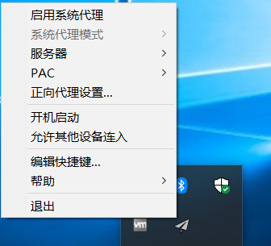

# Shadowsocks 教程：客户端篇

## Windows客户端安装配置

1. 下载安装

[点此下载](https://github.com/shadowsocks/shadowsocks-windows/releases/download/4.1.4/Shadowsocks-4.1.4.zip)Shadowsocks Windows客户端

下载后会得到一个zip压缩包，解压后会得到一个Shadowsocks.exe可执行文件，无需安装，双击即可运行。

2. 填写配置信息

运行后的界面如图：

* 在服务器地址这里填写你的服务器地址;

* 服务器端口这里填写之前记住的shadowsocks服务端口号（那个介于 __1024__ 和 __65535__ 之间的数字）;

* 密码这里填写配置shadowsocks服务端时的设置的密码;

* 加密这里选择`chacha20-ietf-poly1305`；

* 备注这里随便填，相当于给这个服务器取个名字；

填写完之后点确定即可。

3. 启动服务

填写完配置信息后，在任务栏中可以看到一个小飞机图标，如图：

在小飞机图标上右键查看设置，如图：

勾选上`启动系统代理`和`开机启动`即可。现在就可以打开浏览器试试能不能访问Google了。

## Linux客户端安装配置

## Chrome浏览器代理设置

## Android客户端安装配置
