# Shadowsocks 教程：服务器篇

## 原理

简单来说，翻墙的原理就是利用一台墙外的服务器作为中介，让它在墙内的计算机和被屏蔽的网站之间转发数据，从而让墙内的计算机可以访问被屏蔽的网站。更详细的原理介绍可以看这里：[上网限制和翻墙基本原理](https://superxlcr.github.io/2018/07/01/%E4%B8%8A%E7%BD%91%E9%99%90%E5%88%B6%E5%92%8C%E7%BF%BB%E5%A2%99%E5%9F%BA%E6%9C%AC%E5%8E%9F%E7%90%86/)

## 购买服务器

根据翻墙原理我们可以知道，要想翻墙首先需要一台在墙外的服务器。

因为我们的目的是翻墙，所以对服务器的性能没什么要求，但是对网络要求比较高。通常选用VPS(Virtual Private Server 虚拟专用服务器)作为翻墙服务器。

国外的VPS提供商很多，比较知名的有Vultr，搬瓦工，Digital Ocean等，这里有一个比较详细的列表：[10美元以下国内VPS/美国VPS推荐](https://www.vpser.net/ten-dollars-vps)

以Vultr为例，Vultr支持使用支付宝和微信付款，对于国内用户比较方便。

### 访问Vultr官网

访问链接：[https://www.vultr.com/?ref=7858627-4F](https://www.vultr.com/?ref=7858627-4F)

__注意：使用上面这个链接注册，可以直接获得50美元试用金，当你花了25美元后，我也可以获得25美元作为奖励。__

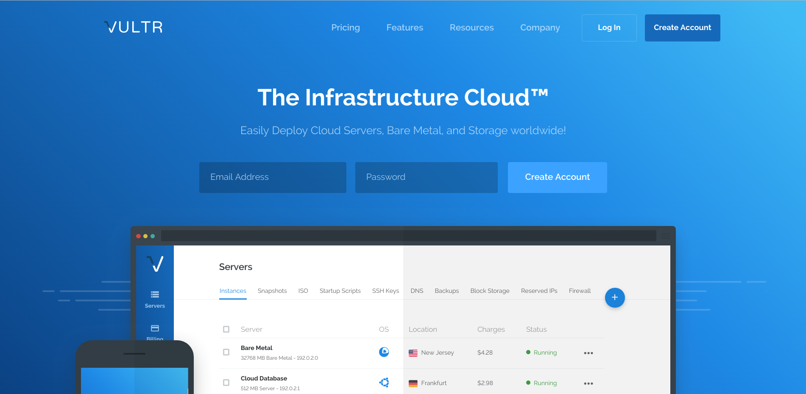

### 注册账户

在`Email Address`这里填写自己的邮箱地址（任何邮箱都可以），`Password`这里填写要创建的Vultr账号的密码，然后点击`Create Account`。之后你填写的邮箱会收到一封来自noreply@vultr.com的邮件，用于激活你的账号，点击邮件中的`Verify Your E-mail`激活即可。

### 充值

上一步中点击`Create Account`后会自动跳转到这个界面：


以使用支付宝支付为例，点击`Alipay`，选中`I Agree to the Terms of Service`，界面如图：


选择你要充值的金额，如果没有你想充值的金额数，那就选择`Other`，然后了手动输入你要充值的金额。之后点击 `Pay with Alipay`，就会跳转到支付宝支付界面，美元会自动按照当前汇率换算成人民币，接下来使用手机扫码付款即可。

支付成功后在`Billing`界面就会显示你账户当前的余额数，如图所示：


右上角会展示你的账户余额，左边黑色的是本月的支出，右边绿色的是当前账户余额。

## 部署服务器

充值成功后就可以部署服务器了。服务器按实际运行时间收费，费用直接从你的账户余额中扣除。注意，即使将服务器关机依旧会正常收费，因为即使关机了也还占用着硬盘和IP地址等资源。要想停止计费只能将服务器销毁(Destroy)。

### 选择服务器配置

在刚才查看余额的页面，点击左边一列图标中的`Servers`，可以看到如下页面：


这里可以看到你部署了的所有服务器，一开始应该是一个都没有的，图上那个`server`是我已经部署好的。（注意，这里我抹去了我服务器的IP地址和所在地区。）

点击右边那个蓝色的加号，进入服务器配置选择界面，如图所示：

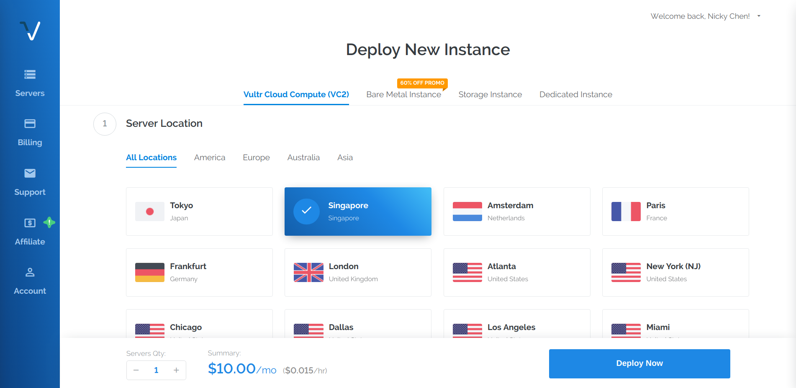

1. 选择服务器所在地区

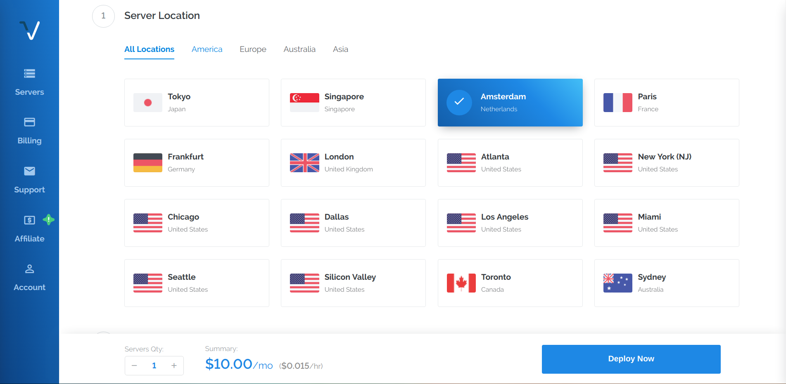

服务器所在地区决定了通过服务器上网的延迟，通常选择离自己近的，也就是Tokyo、Singapore之类的。但正因为选这两个地区的人太多，导致这两个地区的IP地址大量被封，即使偶尔能遇到一两个能用的，也会很快被封锁。所以除非你相信自己的运气，否则不推荐这两个地区。比较推荐的是美国的西海岸和欧洲的服务器。

这里是Vultr官方给出的[各节点测试地址](https://www.vultrvps.com/test-server)，可以自己去测试各节点的网速和延迟，然后再做选择。

2. 选择服务器操作系统

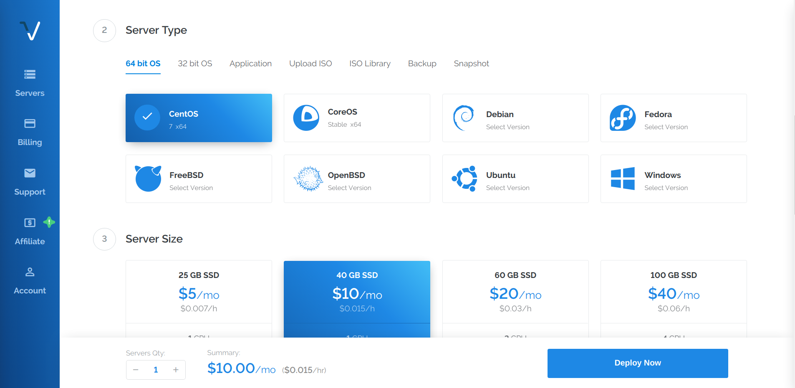

如果你熟悉Linux系统，那就可以选择你自己熟悉的发行版然后跳过这步。否则，按照下图选择：

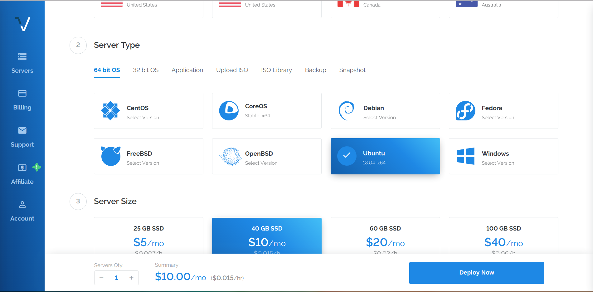

3. 选择服务器的硬件配置

翻墙对服务器性能要求不高，所以直接选择最便宜的5美元每月的版本，如图：

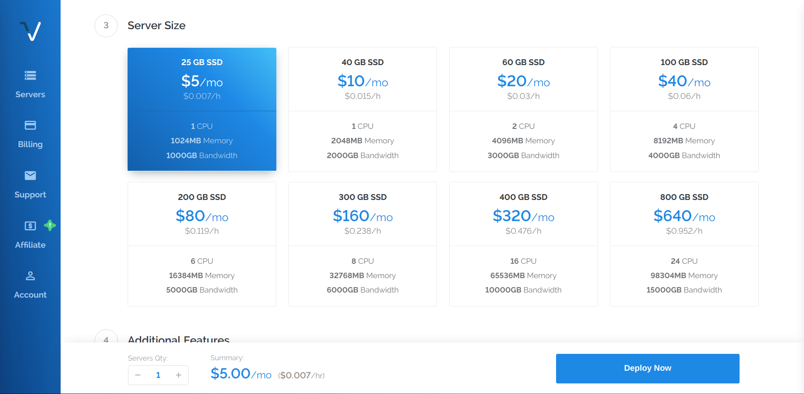

4. 其他功能配置

如图，如果你不知道这些是什么，那就不用管，直接跳过这一步。

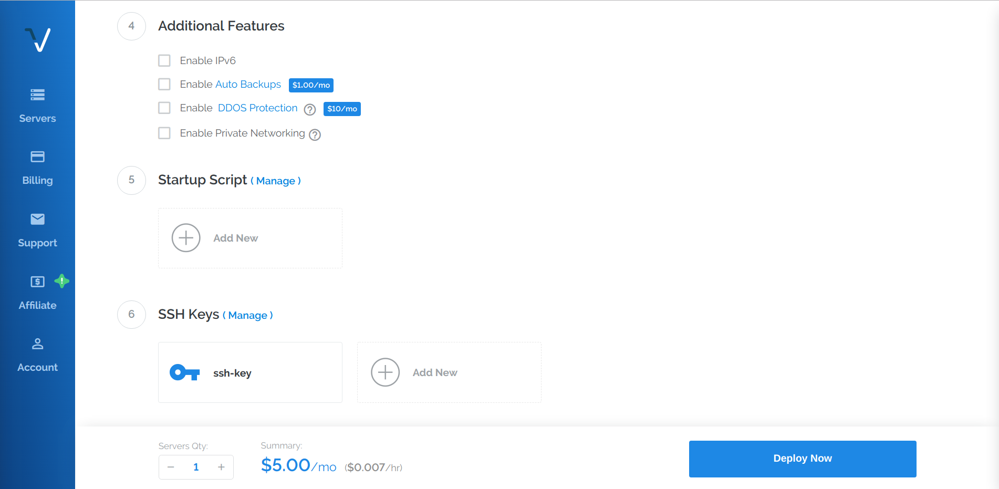

5. 给服务器命名

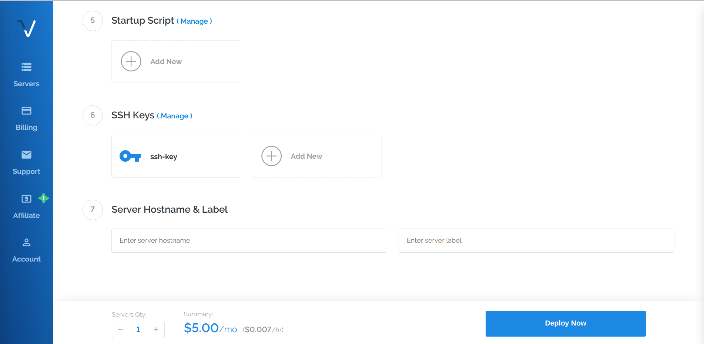

在最后的`Server Hostname & Label`这里分别填上你想给你的这个服务器取的名字，如果你不知道填什么，那就两个都填server即可。

最后点击`Deploy Now`，等待部署完成即可。

### 安装配置 Shadowsocks 服务端

当服务器部署完成后，在[my.vultr.com](https://my.vultr.com/)就能看到正在运行的服务器，如图：


点击服务器的名字，即可查看对应服务器的详情，如图：

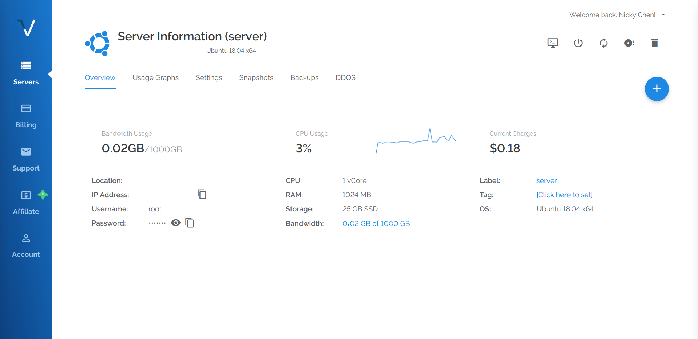

注意图中隐去了服务器的IP地址和所在地区。

这里我们需要记住两个东西，一个是服务器的IP地址，即图中的`IP Address`，另一个是登录密码，也就是图中的`Password`。登录密码默认是隐藏的，点那个小眼睛就可以看到。

* Windows用户配置指南


1. 点击[这里](https://the.earth.li/~sgtatham/putty/latest/w64/putty-64bit-0.70-installer.msi)下载安装PuTTY，安装过程一路下一步即可。

2. 打开PuTTY，界面如图：

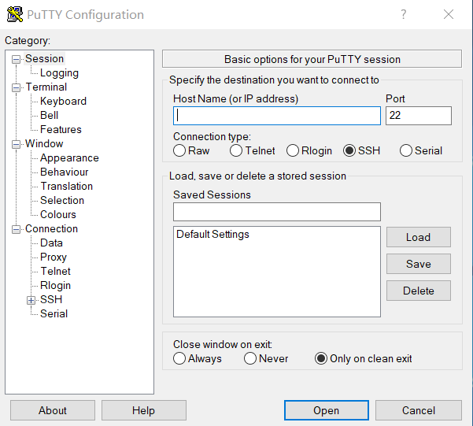

在`Host Name(or IP address)`这里填入你的服务器的IP地址，然后点击底部的`Open`。如果IP地址没有填错的话你将看到这个界面：

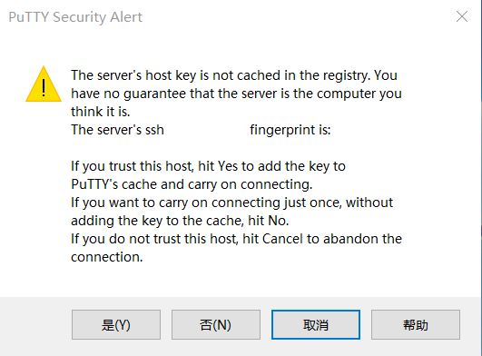

这是问你是否信任这个服务器，直接点是。然后会看到这个界面：

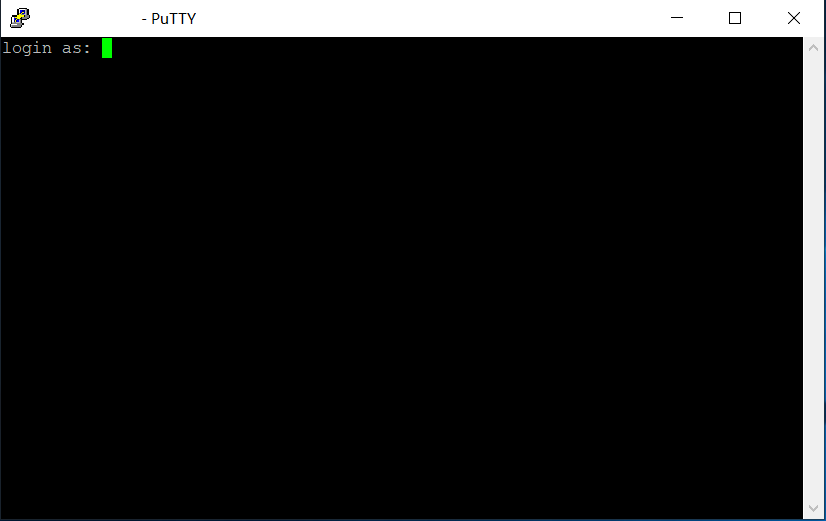

输入`root`，按Enter，然后输入登录密码（刚才让记住的登录密码）再按Enter。为了避免出错，可以复制密码，然后在这个黑框里点右键，即可完成登录。如果密码没有输错的话，你将看到这个界面：

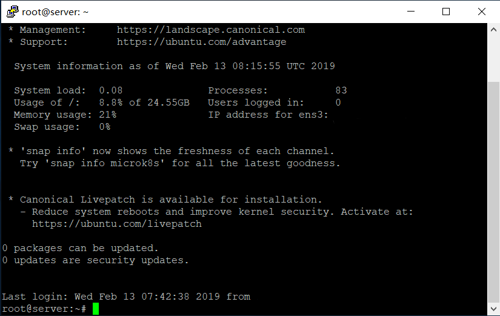

恭喜你，已经顺利连接到服务器了！

3. 像刚才复制密码一样，复制下面这一行命令：

``` shell
apt install curl -y && sh -c "$(curl -fsSL https://raw.githubusercontent.com/nickyc975/shadowsocks-guide/master/scripts/deploy_server.sh)"
```

然后到黑框里右键，然后按Enter，就会自动开始配置shadowsocks服务端。配置过程中需要输入三项信息：

1. 当提示`Input your server ip address: `时，输入你服务器的IP地址，然后按Enter；

2. 当提示`Input your server port: `时，输入一个介于 __1024__ 和 __65535__ 之间的数字，这是你的shadowsocks服务的端口号，记住它，然后按Enter；

3. 当提示`Input your password: `时，输入一个密码，这个密码将用于连接你的shadowsocks服务，记住它，然后按Enter；

当提示`Done!`时，配置就完成了，接下来只要配置好shadowsocks客户端，就可以顺利翻墙了。
